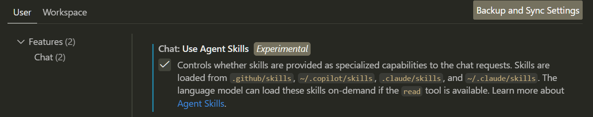

# Agent Skills Demo

This repository demonstrates **Agent Skills** for GitHub Copilot and Claude Code in VS Code Insiders.

## What are Agent Skills?

Agent Skills are folders containing instructions, scripts, and resources that Copilot/Claude automatically loads when relevant to your prompt. They teach the AI how to perform specialized tasks in a specific, repeatable way.

## How It Works

Skills are stored in the `.github/skills` directory. When you interact with Copilot or Claude, they:
1. Analyze your prompt
2. Determine if any skills are relevant
3. Automatically load the skill's instructions
4. Follow those instructions to complete the task

## Skills in This Demo

### Prereq

Make sure you enable the Skills in VS Code



### 🧮 Calculator
**Location:** `.github/skills/calculator/`

Teaches the AI to perform accurate mathematical calculations with proper order of operations.

**Try it:**
- "Calculate 15% of 250"
- "What's (45 + 27) × 3 - 12 / 4?"
- "What's the average of 23, 45, 67, and 89?"

### 📅 Date Formatter
**Location:** `.github/skills/date-formatter/`

Teaches the AI to format dates, calculate date differences, and provide date-related information.

**Try it:**
- "Convert 2025-12-25 to long format"
- "What day of the week is January 1, 2026?"
- "How many days between March 15 and December 25, 2025?"

## Requirements

- **VS Code Insiders** (Skills support coming to stable in early January 2026)
- **GitHub Copilot** subscription
- Skills work in:
  - Copilot agent mode in VS Code
  - Copilot coding agent
  - Copilot CLI

## Creating Your Own Skills

Each skill is a folder containing:

1. **SKILL.md** (required) - Must be uppercase. Main instructions file with:
   - YAML frontmatter containing:
     - `name` (required): Unique identifier, lowercase with hyphens
     - `description` (required): What the skill does and when to use it
     - `license` (optional): License information
   - Markdown body with instructions and examples

2. **Additional resources** (optional) - Scripts, data files, templates

### Skill Structure Example

```
.github/skills/
├── your-skill-name/
│   ├── SKILL.md         # Main instructions (uppercase!)
│   └── data.json        # Optional supporting data
```

### Example SKILL.md Format

```markdown
---
name: your-skill-name
description: Brief description of what the skill does and when to use it
---

# Your Skill Name

## Instructions
1. Step-by-step instructions
2. Guidelines for the AI to follow

## Examples
Concrete examples showing expected behavior
```

## Resources

- 📚 [Official Documentation](https://docs.github.com/copilot/concepts/agents/about-agent-skills)
- 🎯 [Anthropic Skills Repository](https://github.com/anthropics/skills)
- ⭐ [Awesome Copilot Skills](https://github.com/github/awesome-copilot)

## Testing Your Skills

1. Open this repository in VS Code Insiders
2. Open Copilot Chat
3. Try the example prompts above
4. Copilot should automatically load the relevant skill and follow its instructions

## Tips for Writing Skills

- Be specific and clear in your instructions
- Provide concrete examples
- Include error handling guidance
- Test your skills with various prompts
- Keep skills focused on one specific task

## License

This demonstration is provided as-is for educational purposes.
